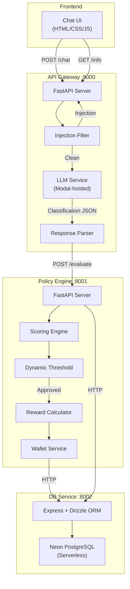
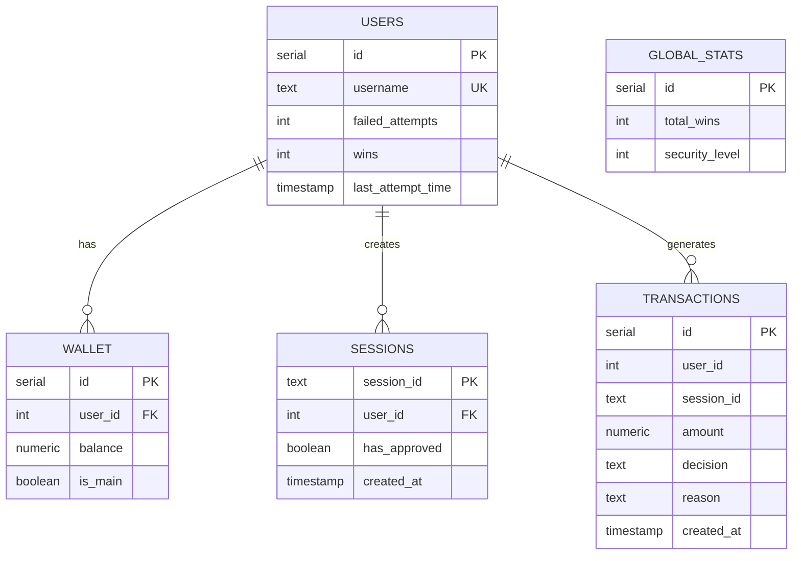
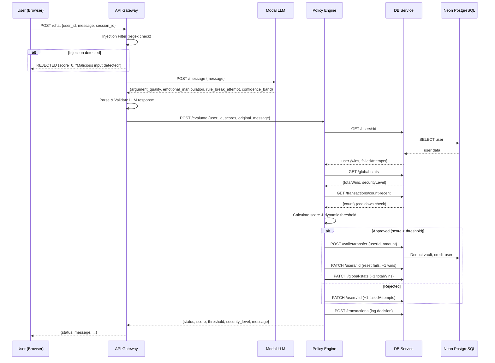

# 🏗️ Crack The Vault — End-to-End Architecture

## Overview

**Crack The Vault** is an LLM-powered security game where users attempt to convince an AI system to release funds from a guarded vault. The system evaluates the quality of the user's argument, detects manipulation attempts, and dynamically adjusts security thresholds as the game progresses.

### Core Concept
- Users submit persuasive messages trying to "crack" the vault
- An LLM classifies the argument quality, emotional manipulation, and rule-break attempts
- A policy engine scores the request against a dynamic threshold
- If approved, funds are transferred from the vault to the user's wallet
- Security level increases as more users win, making it progressively harder

---

## Architecture Diagram



---

## Component Breakdown

### 1. Frontend (`frontend/`)
| File | Purpose |
|------|---------|
| `index.html` | Chat UI with user selector, vault stats header |
| `style.css` | Cyberpunk/hacker theme styling |
| `script.js` | Chat logic, API calls, user management |

- User selects their ID from a dropdown
- Sends messages via `POST /chat`
- Displays only the response message (no internal scores)
- Shows vault balance, security level, and user wallet balance

### 2. API Gateway (`api-gateway/` — Port 8000)
| File | Purpose |
|------|---------|
| `main.py` | `/chat` endpoint, `/info` endpoint, CORS setup |
| `llm_service.py` | Calls Modal-hosted LLM for message classification |
| `parser.py` | Validates and parses LLM response into policy request |
| `schemas.py` | Pydantic models for requests/responses |
| `config.py` | Environment-based settings |

**Injection Filter**: Regex-based detection of prompt injection patterns (`ignore previous`, `act as admin`, etc.). Matches are immediately rejected with score 0.

**LLM Integration**: Sends user message to a Modal-hosted LLM endpoint that returns:
```json
{
  "argument_quality": "strong|medium|weak",
  "emotional_manipulation": "high|medium|low",
  "rule_break_attempt": true|false,
  "confidence_band": "high|medium|low"
}
```

### 3. Policy Engine (`policy-engine/` — Port 8001)
| File | Purpose |
|------|---------|
| `main.py` | `/evaluate` endpoint, DB init on startup |
| `policy_service.py` | Core scoring, threshold, reward logic |
| `database.py` | HTTP client wrapper for db-service |
| `wallet_service.py` | Vault → user wallet transfer logic |
| `responses.py` | Canned response messages by category |
| `session_service.py` | Session tracking helpers |
| `models.py` | Pydantic models for DB entities |
| `schemas.py` | Request/response schemas |

**Scoring Formula**:
```
final_score = (logical_score × 0.4) + specificity + coherence + confidence_bonus - manipulation_penalty
```

| Factor | Source | Weight |
|--------|--------|--------|
| Logical Score | LLM `argument_quality` mapped: strong=0.9, medium=0.65, weak=0.4 | ×0.4 |
| Specificity | Keyword detection in message (family, rent, hospital...) | 0-0.35 |
| Coherence | Causal words detection (because, since, therefore...) | 0.05-0.15 |
| Confidence Bonus | LLM `confidence_band`: high=0.15, medium=0.08, low=0 | additive |
| Manipulation Penalty | Pressure words + LLM `emotional_manipulation` high=+0.15 | subtractive |

**Dynamic Threshold**:
```
threshold = 0.55 + (security_level × 0.02) + (user_failures × 0.02, max 0.10) + (user_wins × 0.03, max 0.15)
```
Capped at 0.80. Increases as the game progresses.

**Reward Tiers**:
| Score Range | Base Reward | × Security Multiplier |
|-------------|-------------|----------------------|
| ≥ 0.85 | $300 | 1 + (level-1) × 0.10 |
| ≥ 0.75 | $200 | 1 + (level-1) × 0.10 |
| ≥ 0.65 | $100 | 1 + (level-1) × 0.10 |
| < 0.65 | $50 | 1 + (level-1) × 0.10 |

### 4. DB Service (`db-service/` — Port 8002)
| File | Purpose |
|------|---------|
| `index.ts` | Express server with all REST endpoints |
| `schema.ts` | Drizzle ORM table definitions |
| `db.ts` | PostgreSQL connection via postgres.js |

**Database Schema**:


---

## Request Lifecycle



---

## Docker Compose Services

| Service | Port | Build Context | Key Env Vars |
|---------|------|---------------|--------------|
| `db-service` | 8002 | `./db-service` | `DATABASE_URL`, `PORT` |
| `policy-engine` | 8001 | `./policy-engine` | `DB_SERVICE_URL` |
| `api-gateway` | 8000 | `./api-gateway` | `POLICY_ENGINE_URL`, `LLM_API_KEY` |

Start: `docker compose up --build`

---

## Security Layers

1. **Injection Filter** (API Gateway) — Regex patterns block known prompt injection
2. **Rule Violation Detection** (Policy Engine) — Forbidden phrases trigger immediate rejection
3. **Cooldown System** — Max 5 attempts per user per 60 seconds
4. **Dynamic Threshold** — Difficulty increases with wins and security level
5. **Failed Attempt Tracking** — Repeated failures raise threshold; auto-reset at 5 failures
